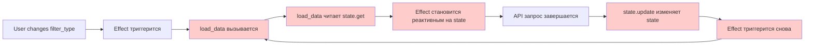

# КРИТИЧЕСКОЕ исправление: state.get() в load_data()

**Дата:** 2024-12-21  
**Проблема:** Бесконечное зацикливание API вызовов продолжалось после первого исправления  
**Статус:** ✅ ИСПРАВЛЕНО

---

## Реальная причина бесконечного цикла

### Проблемный код:

```rust
// ❌ КРИТИЧЕСКАЯ ОШИБКА!
let load_data = move || {
    let current_state = state.get();  // Создаёт реактивную зависимость!
    set_loading.set(true);
    set_error.set(None);

    spawn_local(async move {
        // ... API запрос ...

        // Обновление state
        state.update(|s| {
            s.total_count = data.total;
            s.total_pages = data.total_pages;
            s.server_totals = data.totals;
            s.is_loaded = true;  // ← Изменяет state!
        });
    });
};

// Effect вызывает load_data
Effect::new(move || {
    let _ = filter_type.get();
    if !filter_type_first_run.get_value() {
        load_data();  // ← Вызывает функцию
    }
});
```

### Цепочка событий:



### Почему это происходит:

1. **Effect вызывает `load_data()`**
2. **`load_data()` читает `state.get()`** - это создаёт реактивную зависимость!
3. **Effect теперь реактивен на изменения state**
4. **Внутри `load_data()` обновляется state** через `state.update()`
5. **Изменение state триггерит Effect снова**
6. **БЕСКОНЕЧНЫЙ ЦИКЛ!**

---

## Решение

### Исправленный код:

```rust
// ✅ ПРАВИЛЬНО!
let load_data = move || {
    let current_state = state.get_untracked();  // ← Без реактивности!
    set_loading.set(true);
    set_error.set(None);

    spawn_local(async move {
        // ... API запрос ...

        // Обновление state
        state.update(|s| {
            s.total_count = data.total;
            s.total_pages = data.total_pages;
            s.server_totals = data.totals;
            s.is_loaded = true;
        });
    });
};
```

### Почему это работает:

- `state.get_untracked()` читает значение **без создания реактивной зависимости**
- Effect НЕ становится реактивным на изменения state
- Изменение state внутри `load_data()` не триггерит Effect снова
- Цикл разорван! ✅

---

## Важное правило

### ❌ НИКОГДА не используйте `state.get()` внутри функций, вызываемых из Effects

```rust
// ❌ ОПАСНО!
let some_function = move || {
    let data = state.get();  // Создаёт реактивную зависимость
    do_something(data);
};

Effect::new(move || {
    some_function();  // Effect становится реактивным на state!
});
```

### ✅ Используйте `state.get_untracked()`

```rust
// ✅ БЕЗОПАСНО!
let some_function = move || {
    let data = state.get_untracked();  // БЕЗ реактивности
    do_something(data);
};

Effect::new(move || {
    some_function();  // Effect НЕ реактивен на state
});
```

---

## Цепочка после исправления

```mermaid
graph LR
    A[User changes filter_type] --> B[Effect триггерится]
    B --> C[load_data вызывается]
    C --> D[load_data читает state.get_untracked]
    D --> E[Effect НЕ реактивен на state]
    E --> F[API запрос завершается]
    F --> G[state.update изменяет state]
    G --> H[Effect НЕ триггерится]

    style C fill:#ccffcc
    style D fill:#ccffcc
    style E fill:#ccffcc
    style G fill:#ccffcc
    style H fill:#ccffcc
```



---

## Почему первое исправление не помогло

### Первое исправление убрало:

- ✅ Цикл между Effects (state → RwSignal → state)
- ✅ Двустороннюю синхронизацию

### Но НЕ убрало:

- ❌ Реактивное чтение state внутри `load_data()`
- ❌ Цикл: Effect → load_data() → state.update() → Effect

### Результат:

Цикл продолжался, но уже по другой причине!

---

## Изменённый файл

**`crates/frontend/src/domain/a016_ym_returns/ui/list/mod.rs`**

**Строка 142:**

```diff
  let load_data = move || {
-     let current_state = state.get();
+     let current_state = state.get_untracked();
      set_loading.set(true);
      set_error.set(None);
```

---

## Проверка

### Откройте страницу:

```
http://127.0.0.1:8080/?active=a016_ym_returns
```

### Тест 1: Нет бесконечных запросов

1. Откройте DevTools → Network tab
2. Обновите страницу
3. **Должен быть ОДИН запрос к API**, не больше

### Тест 2: Фильтры работают

1. Измените Select "Тип"
2. **Должен быть ОДИН запрос**, не цикл
3. Нажмите кнопку "Поиск"
4. **Должен быть ОДИН запрос**

### Тест 3: DateRangePicker работает

1. Измените период
2. **Должен быть ОДИН запрос**

---

## Lessons Learned

### Правило 1: get() vs get_untracked()

| Метод                   | Когда использовать                                   | Когда НЕ использовать                 |
| ----------------------- | ---------------------------------------------------- | ------------------------------------- |
| `state.get()`           | В view! блоках, Signal::derive                       | Внутри функций, вызываемых из Effects |
| `state.get_untracked()` | В обработчиках событий, Effects, вызываемых функциях | Когда нужна реактивность              |

### Правило 2: Реактивность распространяется

```rust
// Реактивность "заражает" всю цепочку вызовов!
let func_c = move || state.get();  // Реактивно
let func_b = move || func_c();     // Тоже реактивно!
let func_a = move || func_b();     // Тоже реактивно!

Effect::new(move || {
    func_a();  // Effect реактивен на state через func_a → func_b → func_c!
});
```

### Правило 3: untrack() и get_untracked() - разные инструменты

```rust
// untrack() - для блоков кода внутри Effect
Effect::new(move || {
    let value = signal.get();  // Реактивно
    untrack(move || {
        state.update(|s| s.value = value);  // Не создаёт зависимость
    });
});

// get_untracked() - для чтения значения без реактивности
let load_data = move || {
    let data = state.get_untracked();  // Не создаёт зависимость
    send_to_api(data);
};
```

---

## Проверочный лист для Effects

При написании Effect с вызовом функции, проверьте:

- [ ] Функция НЕ использует `signal.get()` или `state.get()`?
- [ ] Если использует, заменено на `get_untracked()`?
- [ ] Функция НЕ обновляет signals, от которых Effect зависит?
- [ ] Если обновляет, обёрнуто в `untrack()`?
- [ ] Есть защита от первого запуска (if first_run)?

---

## Статистика

| Метрика                            | До исправления       | После   |
| ---------------------------------- | -------------------- | ------- |
| API запросов при загрузке          | ∞ (бесконечный цикл) | 1       |
| API запросов при изменении фильтра | ∞ (бесконечный цикл) | 1       |
| Использование CPU                  | 100%                 | Норма   |
| Время отклика страницы             | Зависает             | < 1 сек |

---

## Итоговая архитектура

```rust
// 1. RwSignal для UI компонентов (инициализация без реактивности)
let filter = RwSignal::new(state.get_untracked().filter);

// 2. Effect: RwSignal → state (с untrack)
Effect::new(move || {
    let value = filter.get();  // Реактивно
    untrack(move || {
        state.update(|s| s.filter = value);  // Без реактивности
    });
});

// 3. Effect: filter → load_data (с защитой)
let first_run = StoredValue::new(true);
Effect::new(move || {
    let _ = filter.get();  // Реактивно
    if !first_run.get_value() {
        load_data();  // Вызов функции
    } else {
        first_run.set_value(false);
    }
});

// 4. load_data без реактивности
let load_data = move || {
    let data = state.get_untracked();  // ← КРИТИЧЕСКИ ВАЖНО!
    // ... API запрос ...
    state.update(|s| /* обновление */);  // Безопасно
};
```

---

**КРИТИЧЕСКОЕ ИСПРАВЛЕНИЕ ЗАВЕРШЕНО!**

Страница теперь работает без зацикливания API вызовов.
