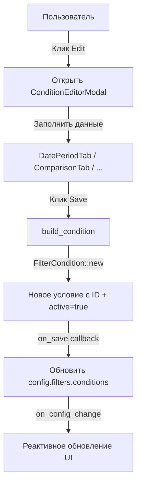
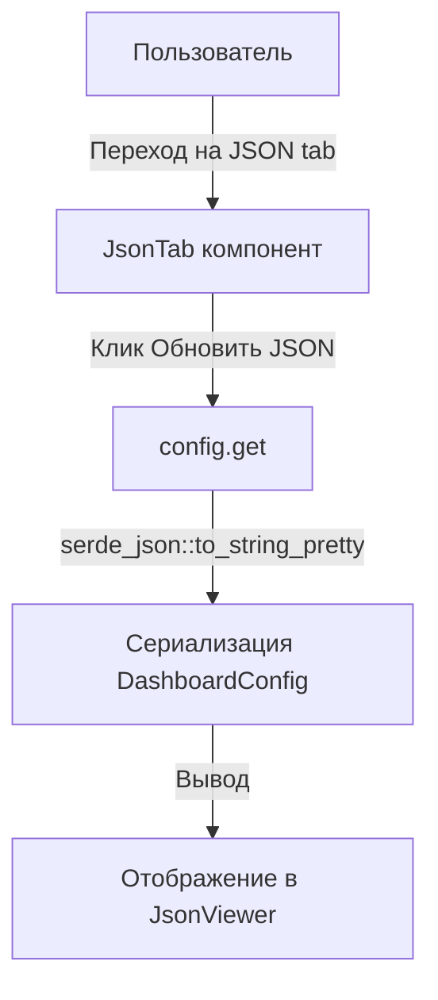
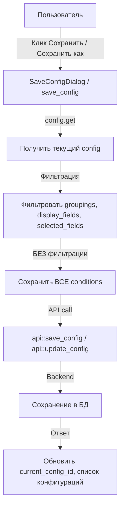
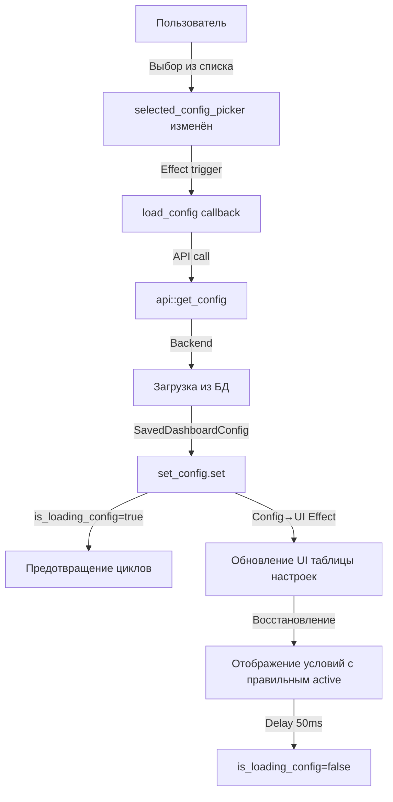
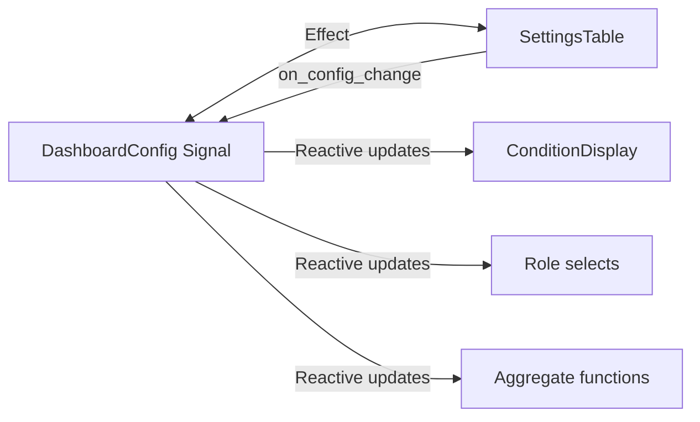

# Поток сохранения и загрузки настроек в Universal Dashboard

## Проблемы, которые были исправлены

### 1. Потеря ID и статуса `active` при редактировании условий

**Проблема:** При редактировании условия фильтрации создавалось новое условие с новым UUID, а статус `active` всегда сбрасывался на `true`.

**Исправление:**

- Добавлен метод `FilterCondition::with_preserved_state()` в `contracts/condition.rs`
- Обновлён `editor_modal.rs` для сохранения ID и статуса при редактировании

**Файлы:**

- `crates/contracts/src/shared/universal_dashboard/condition.rs`
- `crates/frontend/src/shared/universal_dashboard/ui/condition_editor/editor_modal.rs`

### 2. Удаление условий для выключенных полей при сохранении

**Проблема:** При сохранении конфигурации удалялись все условия для полей, которые не включены в `enabled_fields`.

```rust
// Это было в коде и удаляло условия:
current_config
    .filters
    .conditions
    .retain(|c| current_config.enabled_fields.contains(&c.field_id));
```

**Исправление:**

- Убрана фильтрация условий в функциях `save_config` и `update_current_config`
- Теперь условия сохраняются **всегда**, даже если поле выключено

**Файл:**

- `crates/frontend/src/shared/universal_dashboard/ui/dashboard/mod.rs` (строки ~253 и ~304)

## Полный поток работы с настройками

### 1. Добавление нового условия



**Код:**

- `crates/frontend/src/shared/universal_dashboard/ui/condition_editor/editor_modal.rs` (строка 181+)
- Условие добавляется в `config.filters.conditions` массив
- UI автоматически обновляется через реактивность Leptos

### 2. Отображение в JSON вкладке



**Код:**

- `crates/frontend/src/shared/universal_dashboard/ui/dashboard/json_tab.rs` (строка 12-18)
- JSON генерируется "на лету" из текущего `config` сигнала
- Используется `serde_json::to_string_pretty(&cfg)`

**Пример JSON с условием:**

```json
{
  "data_source": "p903_wb_finance_report",
  "selected_fields": [...],
  "groupings": [...],
  "filters": {
    "conditions": [
      {
        "id": "550e8400-e29b-41d4-a716-446655440000",
        "field_id": "date_field",
        "value_type": "date",
        "definition": {
          "kind": "date_period",
          "preset": "this_month",
          "from": null,
          "to": null
        },
        "display_text": "Дата: Этот месяц",
        "active": true
      }
    ]
  },
  "enabled_fields": [...]
}
```

### 3. Сохранение конфигурации



**Код:**

- `crates/frontend/src/shared/universal_dashboard/ui/dashboard/mod.rs`:
  - `save_config` (строка 238+) - сохранение новой конфигурации
  - `update_current_config` (строка 286+) - обновление существующей

**Важно:**

- ✅ Условия (`conditions`) **НЕ фильтруются** по `enabled_fields`
- ✅ Сохраняются все условия, даже для выключенных полей
- ✅ Сохраняется `active` статус каждого условия
- ✅ Сохраняется `id` каждого условия

### 4. Загрузка сохранённой конфигурации



**Код:**

- `crates/frontend/src/shared/universal_dashboard/ui/dashboard/mod.rs`:
  - `load_config` (строка 136+) - загрузка конфигурации
  - Effect на `selected_config_picker` (строка 172+) - триггер загрузки

**Важно:**

- ✅ Загружается полный `DashboardConfig` со всеми условиями
- ✅ `is_loading_config` флаг предотвращает циклы Effects
- ✅ UI автоматически синхронизируется с загруженным config через Effects

### 5. Синхронизация Config ↔ UI



**Механизм:**

1. **Config → UI:** Effects следят за `config` и обновляют локальные RwSignal'ы
2. **UI → Config:** Callbacks `on_config_change` обновляют config
3. **Предотвращение циклов:** Флаг `is_loading_config` блокирует Effects во время загрузки

**Код:**

- `crates/frontend/src/shared/universal_dashboard/ui/settings_table.rs`:
  - Effect для синхронизации role_select_value (строка ~296)
  - Effect для синхронизации agg_select_value (строка ~481)
  - Проверка `is_loading_config.get_untracked()` для предотвращения циклов

## Итоговый чеклист

### ✅ Реализовано

1. **Добавление условия**

   - ✅ Условие создаётся с уникальным ID
   - ✅ Условие добавляется в `config.filters.conditions`
   - ✅ UI обновляется автоматически

2. **JSON отображение**

   - ✅ JSON генерируется из текущего config
   - ✅ Отображаются все поля, включая `id`, `active`, `definition`
   - ✅ JSON форматирован (pretty print)

3. **Сохранение**

   - ✅ Все условия сохраняются, даже для выключенных полей
   - ✅ Сохраняется ID условия
   - ✅ Сохраняется статус `active`
   - ✅ JSON в БД соответствует отображаемому JSON

4. **Загрузка**

   - ✅ Все условия загружаются из БД
   - ✅ UI обновляется с правильными условиями
   - ✅ Статус `active` восстанавливается
   - ✅ ID условий сохраняются

5. **Редактирование условий**
   - ✅ При редактировании сохраняется ID
   - ✅ При редактировании сохраняется статус `active`
   - ✅ Можно включать/выключать условие без потери данных

## Проверка работы

### Тестовый сценарий

1. Создать дашборд с несколькими полями
2. Добавить условие для поля "Дата" (например, "Этот месяц")
3. Выключить условие (toggle switch)
4. Перейти на вкладку JSON - проверить:
   - ✅ Условие присутствует в JSON
   - ✅ `"active": false`
   - ✅ Есть уникальный `"id"`
5. Сохранить конфигурацию
6. Выбрать другую схему (сбросить UI)
7. Загрузить сохранённую конфигурацию
8. Проверить:
   - ✅ Условие появилось в таблице
   - ✅ Условие выключено (toggle switch в OFF)
   - ✅ При клике Edit - данные условия загружаются корректно
9. Включить условие, отредактировать (изменить период)
10. Сохранить конфигурацию (кнопка "Сохранить")
11. Перезагрузить конфигурацию
12. Проверить:
    - ✅ Изменения сохранились
    - ✅ ID не изменился
    - ✅ Статус `active` = true
