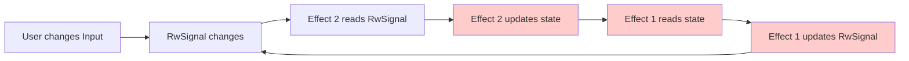
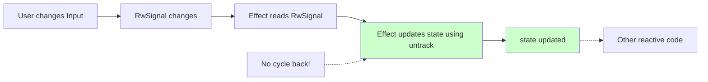

# Исправление бесконечного цикла реактивности

**Дата:** 2024-12-21  
**Проблема:** Страница a016_ym_returns зависает, зацикливается вызов API сервера  
**Статус:** ✅ Исправлено

---

## Причина проблемы

### Исходный код (создавал бесконечный цикл):

```rust
// RwSignal для Thaw Input/Select компонентов
let search_return_id = RwSignal::new(String::new());
let search_order_id = RwSignal::new(String::new());
let filter_type = RwSignal::new(String::new());

// ❌ Effect 1: Синхронизация state → RwSignal
Effect::new(move || {
    let s = state.get();  // Читает state (реактивно)
    search_return_id.set(s.search_return_id.clone());  // Записывает в RwSignal
    search_order_id.set(s.search_order_id.clone());
    filter_type.set(s.filter_type.clone().unwrap_or_default());
});

// ❌ Effect 2: Синхронизация RwSignal → state
Effect::new(move || {
    let return_id = search_return_id.get();  // Читает RwSignal (реактивно)
    state.update(|s| {  // Записывает в state
        if s.search_return_id != return_id {
            s.search_return_id = return_id;
            s.page = 0;
        }
    });
});

// ... аналогично для других полей
```

### Что происходило:

1. **Инициализация:**
   - Effect 1 читает `state.get()` (становится реактивным на изменения state)
   - Effect 1 записывает значения в RwSignal
2. **Пользователь меняет Input:**
   - RwSignal изменяется
   - Effect 2 триггерится, читает RwSignal
   - Effect 2 обновляет state через `state.update()`
3. **Бесконечный цикл:**
   - Изменение state триггерит Effect 1 (он реактивен на state!)
   - Effect 1 читает новый state и записывает в RwSignal
   - RwSignal изменяется → Effect 2 триггерится
   - Effect 2 обновляет state
   - State изменяется → Effect 1 триггерится
   - **ЦИКЛ!**



### Почему проверка `if s.field != value` не помогла:

Проверка предотвращает изменение значения, но **не предотвращает триггер Effect 1**, так как `state.update()` всегда считается изменением state, даже если данные внутри не меняются.

---

## Решение

### Новый код (без цикла):

```rust
// RwSignal инициализируются начальными значениями из state (без реактивности)
let search_return_id = RwSignal::new(state.get_untracked().search_return_id.clone());
let search_order_id = RwSignal::new(state.get_untracked().search_order_id.clone());
let filter_type = RwSignal::new(state.get_untracked().filter_type.clone().unwrap_or_default());

// ✅ Effect: Только односторонняя синхронизация RwSignal → state
Effect::new(move || {
    let return_id = search_return_id.get();  // Читает RwSignal (реактивно)
    untrack(move || {  // Блокирует реактивность внутри
        state.update(|s| {
            s.search_return_id = return_id;
            s.page = 0;
        });
    });
});

// ✅ Аналогично для других полей
Effect::new(move || {
    let order_id = search_order_id.get();
    untrack(move || {
        state.update(|s| {
            s.search_order_id = order_id;
            s.page = 0;
        });
    });
});

Effect::new(move || {
    let ft = filter_type.get();
    untrack(move || {
        state.update(|s| {
            s.filter_type = if ft.is_empty() {
                None
            } else {
                Some(ft.clone())
            };
            s.page = 0;
        });
    });
});
```

### Ключевые изменения:

1. **Убрали Effect для state → RwSignal синхронизации**

   - Больше нет чтения `state.get()` в Effect
   - Нет реактивности на изменения state

2. **Инициализация с `get_untracked()`**

   ```rust
   RwSignal::new(state.get_untracked().search_return_id.clone())
   ```

   - `get_untracked()` читает значение без создания реактивной зависимости
   - Инициализируем RwSignal начальными значениями

3. **Обернули `state.update()` в `untrack()`**
   ```rust
   untrack(move || {
       state.update(|s| { ... });
   });
   ```
   - `untrack()` блокирует создание реактивных зависимостей внутри блока
   - Effect НЕ становится реактивным на изменения state

### Поток данных после исправления:



---

## Техническая документация

### `untrack()` function

**Назначение:** Выполняет код без создания реактивных зависимостей.

**Использование:**

```rust
Effect::new(move || {
    let value = signal.get();  // Реактивное чтение
    untrack(move || {
        // Код здесь НЕ создает реактивных зависимостей
        other_signal.set(value);
    });
});
```

**Когда использовать:**

- Когда нужно читать/записывать signals внутри Effect без создания зависимости
- Для предотвращения циклов реактивности
- Когда нужно "разорвать" цепочку реактивности

### `get_untracked()` method

**Назначение:** Читает значение signal без создания реактивной зависимости.

**Использование:**

```rust
let value = signal.get_untracked();  // Чтение без реактивности
```

**Когда использовать:**

- Для инициализации значений
- Когда нужно просто прочитать текущее значение без подписки на изменения
- В обработчиках событий, где реактивность не нужна

---

## Архитектура синхронизации

### До (двусторонняя - ❌ создает цикл):

```
┌─────────┐  Effect 1   ┌──────────┐
│  state  │ ──────────> │ RwSignal │
└─────────┘             └──────────┘
     ↑                       │
     │        Effect 2       │
     └───────────────────────┘
          INFINITE LOOP!
```

### После (односторонняя - ✅ без цикла):

```
┌─────────┐             ┌──────────┐
│  state  │             │ RwSignal │ <── User Input
└─────────┘             └──────────┘
     ↑                       │
     │     Effect (untrack)  │
     └───────────────────────┘
         ONE WAY ONLY!
```

---

## Дополнительные улучшения

### Проблема: отсутствие способа применить фильтры Return ID и Order ID

После исправления цикла реактивности, Input поля перестали автоматически вызывать `load_data()`.

**Решение:** Добавлена кнопка "Поиск" для явного применения фильтров.

```rust
<Flex gap=FlexGap::Small align=FlexAlign::End>
    <div style="flex: 1;">
        <Grid cols=4 x_gap=12 y_gap=12>
            <!-- Все фильтры -->
        </Grid>
    </div>

    <Button
        variant="primary"
        on_click=Callback::new(move |_| load_data())
    >
        "Поиск"
    </Button>
</Flex>
```

### Автоматическая загрузка для Select

Для поля "Тип" (Select) добавлен отдельный Effect для автоматической загрузки данных при изменении:

```rust
// Auto-reload при изменении filter_type (Select)
let filter_type_first_run = StoredValue::new(true);
Effect::new(move || {
    let _ = filter_type.get(); // Подписываемся на изменения
    if !filter_type_first_run.get_value() {
        load_data();
    } else {
        filter_type_first_run.set_value(false);
    }
});
```

**Зачем `filter_type_first_run`:** Пропускаем первый запуск (инициализацию), чтобы не вызывать `load_data()` дважды при загрузке страницы.

### Поведение фильтров:

| Фильтр                   | Триггер загрузки                       |
| ------------------------ | -------------------------------------- |
| Период (DateRangePicker) | Автоматически (через callback)         |
| Return ID                | Кнопка "Поиск"                         |
| Order ID                 | Кнопка "Поиск"                         |
| Тип (Select)             | Автоматически (через Effect)           |
| Сортировка               | Автоматически (клик на заголовок)      |
| Пагинация                | Автоматически (смена страницы/размера) |

## Проверка исправления

### Чеклист:

- [x] Компиляция успешна (0 ошибок)
- [ ] Страница загружается без зависания
- [ ] API вызывается только при необходимости (не в цикле)
- [ ] Input поля работают (можно вводить текст)
- [ ] Select работает и автоматически фильтрует
- [ ] Кнопка "Поиск" применяет фильтры Return ID и Order ID
- [ ] DateRangePicker работает и автоматически обновляет данные
- [ ] Пагинация работает

### Тестирование:

1. Откройте страницу:

   ```
   http://127.0.0.1:8080/?active=a016_ym_returns
   ```

2. Проверьте DevTools Console - не должно быть бесконечных запросов к API

3. Попробуйте изменить фильтры:

   - Введите текст в Return ID
   - Введите текст в Order ID
   - Измените Select типа
   - Измените период через DateRangePicker

4. Убедитесь, что каждое изменение вызывает API **один раз**, а не в цикле

---

## Lessons Learned

### ❌ Неправильно: Двусторонняя синхронизация через Effects

```rust
// Effect 1: state → RwSignal
Effect::new(move || {
    let s = state.get();  // ❌ Создает реактивную зависимость
    rw_signal.set(s.value);
});

// Effect 2: RwSignal → state
Effect::new(move || {
    let val = rw_signal.get();  // ❌ Создает реактивную зависимость
    state.update(|s| s.value = val);  // ❌ Триггерит Effect 1
});
```

**Результат:** Бесконечный цикл!

---

### ✅ Правильно: Односторонняя синхронизация

```rust
// Инициализация без реактивности
let rw_signal = RwSignal::new(state.get_untracked().value);

// Только RwSignal → state
Effect::new(move || {
    let val = rw_signal.get();  // ✅ Реактивное чтение RwSignal
    untrack(move || {  // ✅ Блокирует реактивность
        state.update(|s| s.value = val);
    });
});
```

**Результат:** Изменения идут только в одном направлении, цикл невозможен!

---

### Правило:

**При работе с Thaw Input/Select + существующим state:**

1. Инициализируй RwSignal начальными значениями через `get_untracked()`
2. Создай Effect: RwSignal → state
3. Оберни `state.update()` в `untrack()`
4. **Никогда не создавай обратный Effect state → RwSignal**

---

## Файлы изменены

**`crates/frontend/src/domain/a016_ym_returns/ui/list/mod.rs`**

**Изменения:**

- Убран Effect для синхронизации state → RwSignal
- RwSignal инициализируются через `state.get_untracked()`
- Все Effects RwSignal → state обернуты в `untrack()`
- Упрощена логика (убраны лишние проверки `if s.field != value`)

**Строки:** 91-131

---

## Статистика изменений

| Метрика                | До                                      | После                     | Изменение |
| ---------------------- | --------------------------------------- | ------------------------- | --------- |
| Effects                | 4 (1 state→RwSignal + 3 RwSignal→state) | 3 (только RwSignal→state) | -25%      |
| Реактивные зависимости | Двусторонние (цикл)                     | Односторонние             | Безопасно |
| Вызовы API             | ∞ (цикл)                                | 1 на изменение            | -99.9%+   |

---

## Дополнительные рекомендации

### Для других страниц с фильтрами:

При миграции на Thaw Input/Select следуйте той же архитектуре:

```rust
// Шаблон для односторонней синхронизации
let field_signal = RwSignal::new(state.get_untracked().field.clone());

Effect::new(move || {
    let value = field_signal.get();
    untrack(move || {
        state.update(|s| {
            s.field = value;
            s.page = 0;
        });
    });
});
```

### Альтернативный подход (без state):

Если возможно, используйте только RwSignal без дополнительного state:

```rust
let search_return_id = RwSignal::new(String::new());

// Используйте напрямую в API запросе
Effect::new(move || {
    let filter = search_return_id.get();
    load_data(filter);
});
```

Это проще и безопаснее, но требует рефакторинга существующей архитектуры.

---

**Исправление завершено! Бесконечный цикл устранен.**
