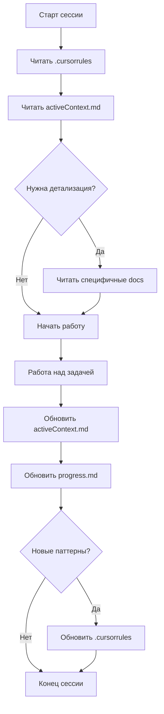

# Memory Bank Setup Complete ✅

*Дата создания: 2025-11-26*

## 🎉 Что было сделано

### 1. Создан `.cursorrules` в корне проекта
Файл содержит:
- Быстрый overview проекта
- Архитектурные принципы
- Систему индексированного именования (a001-a499, u501-u999, p901-p999)
- Критичные паттерны разработки
- Environment-specific правила (Windows/PowerShell)
- Ссылки на детальную документацию

**Для AI**: Это первый файл, который нужно читать при старте работы.

### 2. Созданы 5 core файлов Memory Bank

#### `memory-bank/projectbrief.md` (Foundation)
- Цель проекта и проблемы, которые решаем
- Ключевые функции
- Технологический стек
- Целевая аудитория
- Принципы разработки

#### `memory-bank/activeContext.md` (Current State)
- Текущий фокус работы
- Недавние изменения (git status)
- Следующие шаги
- Активные технические решения
- Контекст для AI

#### `memory-bank/systemPatterns.md` (Architecture)
- Архитектурный обзор (DDD + VSA)
- Индексированная система именования
- Domain layer patterns
- Frontend patterns
- Database patterns
- API patterns
- Ключевые правила (DO/DON'T)

#### `memory-bank/techContext.md` (Tech Stack)
- Технологический стек (Leptos, Axum, SQLite)
- Development environment (Windows/PowerShell)
- Build & development команды
- Database management
- External integrations (1C, Wildberries, Ozon)
- Technical constraints
- Development workflow

#### `memory-bank/progress.md` (Status)
- ✅ Реализовано и работает (по категориям)
- 🔨 В процессе разработки
- 📋 Планируется (backlog)
- 🐛 Известные проблемы
- 📊 Статистика проекта
- 🎯 Milestones

### 3. Реорганизована документация

Создана структура папок:

```
memory-bank/
├── projectbrief.md          # Core: Foundation
├── activeContext.md         # Core: Current state
├── systemPatterns.md        # Core: Architecture
├── techContext.md           # Core: Tech stack
├── progress.md              # Core: Status
│
├── architecture/            # Детальная архитектурная документация
│   ├── domain-layer-architecture.md
│   ├── naming-conventions.md
│   ├── project-structure.md
│   ├── aggregate-standard.md
│   ├── aggregate-structure-final.md
│   └── migration-to-standard.md
│
├── code-standards/          # Стандарты кодирования
│   ├── code-quality-rules.md
│   └── dev-commands.md
│
├── features/                # Документация по фичам
│   ├── usecase-u501-import-from-ut.md
│   ├── README_u501.md
│   ├── aggregate_picker_implementation.md
│   ├── generic_picker_plan.md
│   └── b2b.yaml (LemanaPro API spec)
│
└── todo/                    # Планируемые фичи
    ├── field-metadata-system.md
    └── sales-register/
        ├── sales-register-data.md
        └── sales-register-scheme.md
```

### 4. Удалены устаревшие файлы

Из корня проекта удалено **70+ временных .md файлов**:
- `IMPLEMENTATION_*.md` - файлы реализации
- `FIX_*.md` - багфиксы
- `UI_IMPROVEMENTS_*.md` - улучшения UI
- `UI_UPDATES_*.md` - обновления UI
- `DEBUG_*.md` - отладка
- `TESTING_*.md` - тестовые заметки
- `BUGFIX_*.md` - исправления
- `MIGRATION_*.md` - миграции
- `STAGE_6_*.md` - stage файлы
- И другие временные документы

**Результат**: Чистый корень проекта, только актуальная документация.

### 5. Создан основной README.md

Новый `README.md` в корне содержит:
- Quick Start инструкции
- Ссылки на всю документацию
- Архитектурный обзор
- Основные фичи
- Development команды
- Информация о БД

## 📊 Итоговая структура проекта

```
leptos_marketplace_1/
├── .cursorrules              # ← AI quick reference
├── README.md                 # ← Project overview
│
├── crates/                   # Код проекта
│   ├── contracts/
│   ├── backend/
│   └── frontend/
│
├── memory-bank/              # ← AI Knowledge Base
│   ├── [5 core files]        # Foundation документы
│   ├── architecture/         # Архитектура
│   ├── code-standards/       # Стандарты
│   ├── features/             # Фичи
│   └── todo/                 # Планы
│
├── docs/                     # Дополнительные гайды
│   ├── wildberries_api_investigation.md
│   ├── list-search-sort-guide.md
│   └── ...
│
├── marketplace.db            # SQLite база
├── migrate_*.sql             # Миграции
└── dist/                     # Build output
```

## 🎯 Как использовать Memory Bank

### Для AI-ассистента

**При старте новой сессии:**
1. Прочитать `.cursorrules` - быстрый контекст
2. Прочитать `memory-bank/activeContext.md` - где остановились
3. При необходимости углубиться в специфические разделы

**При команде "update memory bank":**
1. Прочитать ВСЕ 5 core файлов
2. Обновить `activeContext.md` - текущий фокус
3. Обновить `progress.md` - статус задач
4. Обновить `.cursorrules` - если обнаружены новые паттерны

### Для разработчиков

**Quick start:** Читать `README.md` → `memory-bank/projectbrief.md`

**Архитектура:** Читать `memory-bank/systemPatterns.md` → `memory-bank/architecture/`

**Конкретная фича:** Искать в `memory-bank/features/`

**Стандарты кода:** Читать `memory-bank/code-standards/`

## ✨ Преимущества новой структуры

1. **Быстрый старт AI**: `.cursorrules` + 5 core файлов = полный контекст за минуту
2. **Иерархия**: Core → Details → Implementation
3. **Актуальность**: Старые временные файлы удалены
4. **Навигация**: Логичная структура папок
5. **Масштабируемость**: Легко добавлять новые документы
6. **Maintenance**: Понятно где что обновлять

## 🔄 Рабочий процесс



## 📝 Следующие шаги (опционально)

1. Добавить в `.gitignore`:
   ```
   MEMORY_BANK_SETUP_COMPLETE.md
   ```

2. При желании создать дополнительные документы:
   - `memory-bank/features/a014_ozon_transactions.md` - детали по Ozon транзакциям
   - `memory-bank/features/p904_sales_analytics.md` - детали по аналитике
   - И т.д. для других важных фич

3. Периодически обновлять `progress.md` и `activeContext.md`

4. При обнаружении новых паттернов - документировать в `.cursorrules`

## 🎓 Обучение AI

Система Memory Bank следует принципу из user rules:
> "After each reset, I rely ENTIRELY on my Memory Bank to understand the project"

**Теперь у AI есть:**
- ✅ Быстрый контекст (`.cursorrules`)
- ✅ Foundation (5 core files)
- ✅ Детальная информация (structured folders)
- ✅ Актуальное состояние (activeContext, progress)
- ✅ Чистый проект (без временных файлов)

---

**Memory Bank готов к использованию! 🚀**

*После прочтения этого файла, его можно удалить или переместить в memory-bank/todo/ для истории.*

