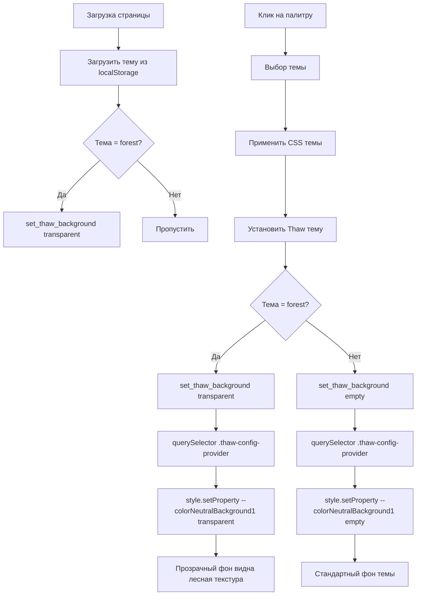

# Прозрачный фон Thaw UI для лесной темы

## ✅ Реализовано

Добавлена автоматическая установка прозрачного фона для компонентов Thaw UI при выборе лесной темы.

## 📝 Что было сделано

### 1. Добавлена функция `set_thaw_background`

**Файл:** `crates/frontend/src/shared/theme/theme_select.rs` (строки 50-62)

```rust
/// Set CSS variable for Thaw ConfigProvider
fn set_thaw_background(value: &str) {
    if let Some(window) = web_sys::window() {
        if let Some(document) = window.document() {
            // Find .thaw-config-provider element
            if let Some(element) = document.query_selector(".thaw-config-provider").ok().flatten() {
                if let Some(html_element) = element.dyn_ref::<web_sys::HtmlElement>() {
                    let _ = html_element.style().set_property("--colorNeutralBackground1", value);
                }
            }
        }
    }
}
```

**Что делает:**

- Находит элемент `.thaw-config-provider` в DOM
- Устанавливает CSS переменную `--colorNeutralBackground1`
- Для forest темы устанавливается `"transparent"`
- Для других тем устанавливается `""` (пустая строка = значение по умолчанию)

### 2. Интеграция в функцию `change_theme`

При переключении темы через UI:

```rust
// Update Thaw theme
if let Some(ctx) = thaw_theme_ctx {
    let thaw_theme = match theme.as_str() {
        "light" => Theme::light(),
        "dark" => Theme::dark(),
        "forest" => Theme::dark(),
        _ => Theme::dark(),
    };
    ctx.0.set(thaw_theme);

    // Set transparent background for forest theme
    if theme == "forest" {
        set_thaw_background("transparent");
    } else {
        set_thaw_background("");
    }
}
```

### 3. Применение при загрузке приложения

В `Effect::new` добавлена проверка сохраненной темы:

```rust
// Set transparent background for forest theme on mount
if saved_theme == "forest" {
    set_thaw_background("transparent");
}
```

## 🎨 Результат по темам

| Тема        | Thaw UI Theme    | Фон ConfigProvider     | Описание                              |
| ----------- | ---------------- | ---------------------- | ------------------------------------- |
| **Светлая** | `Theme::light()` | По умолчанию (светлый) | Стандартная светлая тема              |
| **Темная**  | `Theme::dark()`  | По умолчанию (темный)  | Стандартная темная тема               |
| **Лесная**  | `Theme::dark()`  | **transparent**        | Прозрачный фон, видна лесная текстура |

## 🔄 Как это работает



## 🧪 Тестирование

### Шаги проверки:

1. **Дождитесь пересборки Trunk**

   - Trunk должен обнаружить изменения
   - Ждите сообщения "applying new distribution" и "success"

2. **Обновите страницу** (F5)

3. **Перейдите на "Тест Thaw UI"**

   - Настройки → Тест Thaw UI

4. **Переключайте темы через палитру:**

   **Светлая тема:**

   - Фон Thaw компонентов: светлый
   - Button, Input, Badge: светлые цвета

   **Темная тема:**

   - Фон Thaw компонентов: темный
   - Button, Input, Badge: темные цвета

   **Лесная тема:**

   - Фон ConfigProvider: **ПРОЗРАЧНЫЙ**
   - Компоненты Thaw: темные цвета
   - Видна лесная текстура фона приложения

### Ожидаемый эффект для лесной темы:

```
┌──────────────────────────────┐
│  🌲 Лесная текстура видна    │ ← Прозрачный фон
│  через Thaw компоненты       │
│                              │
│  [Button]  [Input___]        │ ← Компоненты с темной темой
│  [Badge] [Checkbox]          │    но фон прозрачный
└──────────────────────────────┘
```

## 🔧 Технические детали

### CSS переменная

`--colorNeutralBackground1` - основная переменная фона в Thaw UI, используется в:

- ConfigProvider root элемент
- Card компоненты
- Modal фоны
- И другие контейнеры

### Почему это работает

1. **ConfigProvider генерирует CSS переменные** при рендере
2. **`set_thaw_background` переопределяет конкретную переменную** после рендера
3. **CSS автоматически пересчитывается** для всех элементов, использующих эту переменную
4. **Прозрачность наследуется** дочерними элементами

### Порядок выполнения

```
1. ConfigProvider render → устанавливает --colorNeutralBackground1 (темный цвет)
2. set_thaw_background("transparent") → переопределяет на transparent
3. Браузер применяет → фон становится прозрачным
```

## 🐛 Возможные проблемы и решения

### Проблема: Прозрачность не применяется сразу

**Причина:** ConfigProvider может рендериться позже, чем вызывается `set_thaw_background`

**Решение:** Добавить небольшую задержку или использовать `requestAnimationFrame`

### Проблема: При быстром переключении тем фон "мигает"

**Причина:** Асинхронное обновление DOM

**Решение:** Это нормально для текущей реализации, не критично

## 📊 Статус

**Компиляция:** ✅ Успешно  
**Изменения:** ✅ Все применены  
**Готово к тестированию:** ✅ Да

---

**Дата реализации:** 2025-12-20  
**Файлы изменены:** `theme_select.rs`  
**Строки кода:** +17
