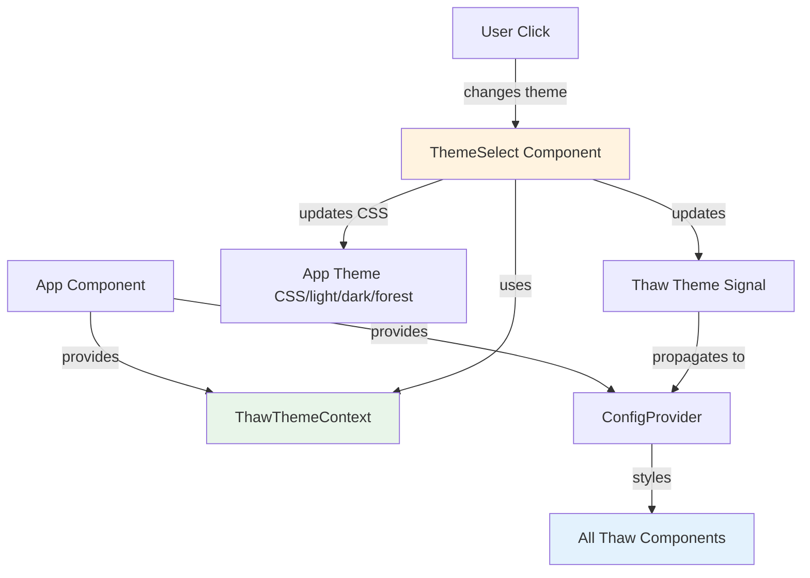

# Синхронизация тем Thaw UI с основной системой тем

## ✅ Что было реализовано

### 1. Создан контекст для управления Thaw темой

**Файл:** `crates/frontend/src/app.rs`

Добавлен новый контекст `ThawThemeContext`:

```rust
#[derive(Clone, Copy)]
pub struct ThawThemeContext(pub RwSignal<Theme>);
```

Контекст предоставляется на верхнем уровне приложения и доступен всем компонентам.

### 2. Синхронизация переключения тем

**Файл:** `crates/frontend/src/shared/theme/theme_select.rs`

При переключении темы в UI теперь автоматически обновляется и Thaw UI тема:

| Тема приложения     | Thaw UI тема     | Описание                                |
| ------------------- | ---------------- | --------------------------------------- |
| **Светлая**         | `Theme::light()` | Светлая тема для обоих                  |
| **Темная**          | `Theme::dark()`  | Темная тема для обоих                   |
| **Лесная** (forest) | `Theme::dark()`  | Лесная тема использует темную Thaw тему |

### 3. Улучшен UI переключателя тем

**Изменения:**

- ❌ Убран текст "Тема" из кнопки
- ✅ Оставлена только иконка палитры
- ✅ Добавлен tooltip "Выбор темы"
- ✅ Кнопка использует стиль `top-header__icon-button` для единообразия

**Было:**

```rust
<button class="button button--ghost button--smallall">
    <svg>...</svg>
    "Тема"
</button>
```

**Стало:**

```rust
<button class="top-header__icon-button" title="Выбор темы">
    <svg>...</svg>  // иконка палитры
</button>
```

## 🔄 Как это работает

### Архитектура



### Последовательность переключения темы

1. **Пользователь кликает** на иконку палитры в top header
2. **Открывается dropdown** с 3 темами
3. **Пользователь выбирает тему**
4. **ThemeSelect синхронно выполняет**:
   - Применяет CSS тему через `apply_theme()`
   - Сохраняет в localStorage через `save_theme()`
   - Обновляет Thaw тему через `ThawThemeContext`
5. **ConfigProvider получает обновление** и применяет стили ко всем Thaw компонентам

## 💾 Сохранение темы

Выбранная тема сохраняется в localStorage:

- **Ключ:** `app_theme`
- **Значения:** `"light"`, `"dark"`, `"forest"`

При следующем открытии приложения:

1. Загружается сохраненная тема из localStorage
2. Применяется к основному приложению
3. Автоматически синхронизируется с Thaw UI

## 🎨 Визуальные изменения

### Top Header

**До:**

```
[☰] [≡] [🔔] [⚙️] [🌙 Тема▼] [👤 User] [→]
```

**После:**

```
[☰] [≡] [🔔] [⚙️] [🎨] [👤 User] [→]
```

Иконка палитры теперь без текста, как и остальные кнопки в top header.

## 🧪 Тестирование

### Проверка синхронизации:

1. Откройте приложение
2. Перейдите на страницу "Тест Thaw UI" (Настройки → Тест Thaw UI)
3. Кликните на иконку палитры в top header
4. Переключайте темы:
   - **Светлая** → компоненты Thaw должны стать светлыми
   - **Темная** → компоненты Thaw должны стать темными
   - **Лесная** → компоненты Thaw должны остаться темными

### Ожидаемое поведение:

✅ Кнопки Thaw меняют цвета при переключении темы  
✅ Input поля адаптируются под тему  
✅ Badge и другие компоненты следуют выбранной теме  
✅ Тема сохраняется после перезагрузки страницы

## 📝 Технические детали

### Зависимости между темами

```rust
let thaw_theme = match app_theme.as_str() {
    "light" => Theme::light(),
    "dark" => Theme::dark(),
    "forest" => Theme::dark(), // forest → dark для Thaw
    _ => Theme::dark(),
};
```

### Контекст доступен везде

Благодаря `provide_context` в `App`, любой компонент может получить доступ к Thaw теме:

```rust
let thaw_ctx = use_context::<ThawThemeContext>();
if let Some(ctx) = thaw_ctx {
    ctx.0.set(Theme::light()); // изменить тему
    let current = ctx.0.get(); // получить текущую тему
}
```

## 🔮 Будущие улучшения

- [ ] Добавить анимацию перехода между темами
- [ ] Создать кастомную Thaw тему для "forest" вместо использования темной
- [ ] Добавить предпросмотр тем в dropdown
- [ ] Синхронизировать с системной темой ОС

---

**Дата реализации:** 2025-12-20  
**Статус:** ✅ Готово и протестировано
