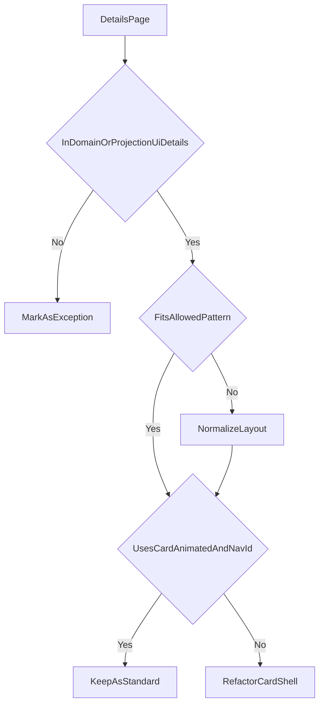

# Details Page Layout Standard

_Last updated: 2026-03-09_

## Scope

This standard applies only to domain/projection pages in `crates/frontend/src/**/ui/details/**`.

Out of scope:
- generic/shared inspector pages
- dashboard/view surfaces
- LLM workflow pages
- system/admin details
- modal-like pages that are not real tab/page details

## Allowed Patterns

### 1. `TwoColumnOverview`

Use for overview tabs such as `general` and some read-only `line` tabs.

Structure:
- `detail-grid`
- two `detail-grid__col`
- stacked `CardAnimated` in each column

Reference examples:
- `crates/frontend/src/domain/a015_wb_orders/ui/details/tabs/general.rs`
- `crates/frontend/src/domain/a013_ym_order/ui/details/tabs/general.rs`

### 2. `SingleCard`

Use for edit/config/meta/form tabs.

Structure:
- one full-width `CardAnimated`
- no extra layout wrapper beyond the normal page/tab content container

Reference examples:
- `crates/frontend/src/domain/a024_bi_indicator/ui/details/tabs/general.rs`
- `crates/frontend/src/domain/a025_bi_dashboard/ui/details/tabs/meta.rs`

### 3. `DataTab`

Use for JSON/table/test/linked-record tabs.

Structure:
- one full-width `CardAnimated`
- loading, error, empty and main states use the same card shell pattern

Reference examples:
- `crates/frontend/src/domain/a015_wb_orders/ui/details/tabs/links.rs`
- `crates/frontend/src/domain/a015_wb_orders/ui/details/tabs/sales.rs`

## Required Rules

- Use `CardAnimated`, not raw `Card`.
- Every `CardAnimated` must have `nav_id`.
- Avoid ad-hoc layout wrappers if one of the allowed patterns fits.
- Do not render empty placeholder `

` blocks instead of omitting a card.

## Card Content Types

Each in-scope `CardAnimated` should also match one internal content type.

### `EditCard`

Use for editable or read-only cards built around form controls.

Structure:
- `details-section__title`
- optional `form__hint`
- stack or grid of `form__group`
- `form__label` for field captions

Reference example:
- `crates/frontend/src/domain/a012_wb_sales/ui/details/tabs/general.rs` → `a012_wb_sales_details_general_warehouse`

### `ViewCard`

Use for read-only summary cards that show label/value pairs, metadata, badges, links, and short status summaries.

Structure:
- `details-section__title`
- consistent label/value layout
- no fake form shell when there are no real form controls

Reference example:
- `crates/frontend/src/domain/a021_production_output/ui/details/mod.rs` → `a021_production_output_detail_document`

### `ActionCard`

Use for cards that drive a workflow such as test/preview/run/configure.

Structure:
- `details-section__title`
- optional `form__hint`
- explicit controls section
- explicit state section
- explicit result section

Reference target:
- `crates/frontend/src/domain/a024_bi_indicator/ui/details/tabs/data_spec.rs` → `a024_bi_indicator_details_data_spec_test`

### `ExceptionCard`

Use only for special-review pages where the card genuinely does not fit `EditCard`, `ViewCard`, or `ActionCard`.

Rules:
- document why it is an exception
- do not treat it as a reusable default
- keep it out of bulk refactoring recipes

## Card Content Anti-Patterns

- repeated inline styles for layout, spacing, color, and typography inside cards
- mixing summary, actions, errors, and result panels without explicit structure
- using `form__group` only sometimes in a form-like card
- introducing `CustomCard` as a normal reusable category instead of escalating to `ExceptionCard`

## Inventory

### Standard / Reference

- `a015_wb_orders`
- `a024_bi_indicator`
- `a025_bi_dashboard` (except `tabs/layout.rs`, special review)

### Needs `nav_id` rollout

- `crates/frontend/src/domain/a004_nomenclature/ui/details/tabs/general.rs`
- `crates/frontend/src/domain/a004_nomenclature/ui/details/tabs/barcodes.rs`
- `crates/frontend/src/domain/a004_nomenclature/ui/details/tabs/dealer_prices.rs`
- `crates/frontend/src/domain/a004_nomenclature/ui/details/tabs/dimensions.rs`
- `crates/frontend/src/domain/a013_ym_order/ui/details/tabs/general.rs`
- `crates/frontend/src/domain/a020_wb_promotion/ui/details/tabs/general.rs`
- `crates/frontend/src/domain/a025_bi_dashboard/ui/details/tabs/general.rs`
- `crates/frontend/src/domain/a025_bi_dashboard/ui/details/tabs/meta.rs`
- `crates/frontend/src/domain/a025_bi_dashboard/ui/details/tabs/filters.rs`

### Needs `Card` -> `CardAnimated`

- `crates/frontend/src/domain/a012_wb_sales/ui/details/tabs/json.rs`
- `crates/frontend/src/domain/a012_wb_sales/ui/details/tabs/links.rs`
- `crates/frontend/src/domain/a012_wb_sales/ui/details/tabs/line.rs`
- `crates/frontend/src/domain/a013_ym_order/ui/details/tabs/links.rs`
- `crates/frontend/src/domain/a021_production_output/ui/details/mod.rs`
- `crates/frontend/src/domain/a022_kit_variant/ui/details/mod.rs`
- `crates/frontend/src/domain/a023_purchase_of_goods/ui/details/mod.rs`

### Needs layout normalization

- `crates/frontend/src/domain/a012_wb_sales/ui/details/tabs/line.rs`
- `crates/frontend/src/domain/a021_production_output/ui/details/mod.rs`
- `crates/frontend/src/domain/a022_kit_variant/ui/details/mod.rs`
- `crates/frontend/src/domain/a023_purchase_of_goods/ui/details/mod.rs`

### Special review before refactor

- `crates/frontend/src/domain/a024_bi_indicator/ui/details/tabs/preview.rs`
- `crates/frontend/src/domain/a024_bi_indicator/ui/details/tabs/view_spec.rs`
- `crates/frontend/src/domain/a025_bi_dashboard/ui/details/tabs/layout.rs`
- cards that require `ExceptionCard` treatment

## Exclusions

These pages are intentionally excluded from the standard and bulk refactor:

### Generic / shared tooling

- `crates/frontend/src/data_view/ui/detail/widget.rs`
- `crates/frontend/src/shared/universal_dashboard/ui/schema_details/page.rs`
- `crates/frontend/src/shared/universal_dashboard/ui/all_reports_details/mod.rs`

### Dashboard / view surfaces

- `crates/frontend/src/domain/a025_bi_dashboard/ui/dashboard/page.rs`
- `crates/frontend/src/dashboards/`

### LLM workflow pages

- `crates/frontend/src/domain/a018_llm_chat/ui/details/view.rs`
- `crates/frontend/src/domain/a019_llm_artifact/ui/details/view.rs`

### System / admin details

- `crates/frontend/src/system/tasks/ui/details/mod.rs`

## Decision Model

