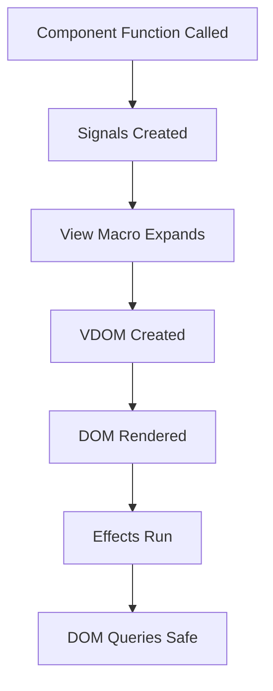

# Lesson Learned: CSS Variable Manipulation Timing in Leptos/WASM

## Context

When implementing transparent background for Thaw UI's forest theme, needed to programmatically modify CSS variables on DOM elements rendered by Leptos components.

## The Lesson

**CSS variable manipulation in Leptos/WASM works reliably when:**

1. **Called from `Effect::new` after component mount**

   - DOM elements are guaranteed to exist
   - ConfigProvider has already rendered and created `.thaw-config-provider` element

2. **Called from user event handlers (e.g., button clicks)**
   - Synchronous execution after user interaction
   - DOM is stable and fully rendered

**Key insight**: Unlike JavaScript's `DOMContentLoaded`, Leptos's `Effect::new` runs after the component tree is rendered, making it safe for DOM queries.

## What Worked

```rust
// ✅ Works: Called in Effect after mount
Effect::new(move |_| {
    apply_theme(&saved_theme);
    if saved_theme == "forest" {
        set_thaw_background("transparent"); // DOM element exists
    }
});

// ✅ Works: Called in event handler
let change_theme = move |theme: String| {
    apply_theme(&theme);
    if theme == "forest" {
        set_thaw_background("transparent"); // Synchronous, DOM stable
    }
};
```

## What Could Fail (Hypothetically)

```rust
// ⚠️ Potential issue: Called during component construction
#[component]
pub fn ThemeSelect() -> impl IntoView {
    // This might run before DOM is ready
    set_thaw_background("transparent"); // Element might not exist yet!

    view! { /* ... */ }
}

// ⚠️ Potential issue: Race condition with async
spawn_local(async move {
    some_async_operation().await;
    set_thaw_background("transparent"); // Element might be unmounted!
});
```

## Why This Matters

1. **Silent failures**: `query_selector` returns `None` if element doesn't exist, but function doesn't report errors
2. **Debugging difficulty**: No compile-time checks for DOM structure
3. **WASM specifics**: DOM manipulation from Rust requires careful timing awareness

## Technical Explanation

### Leptos Rendering Lifecycle



**Safe zones for DOM manipulation**:

- ✅ Inside `Effect::new` (runs after render)
- ✅ Inside event handlers (user-triggered, DOM stable)
- ✅ Inside `create_effect` (reactive, runs after dependencies)

**Unsafe zones**:

- ❌ During component construction (before render)
- ❌ Before ConfigProvider has rendered
- ⚠️ Async contexts (element might unmount)

### Web_sys Query Pattern

```rust
// Robust pattern: Option chaining with early returns
fn set_css_variable(selector: &str, property: &str, value: &str) -> bool {
    let window = web_sys::window()?;
    let document = window.document()?;
    let element = document.query_selector(selector).ok()??;
    let html_element = element.dyn_ref::<web_sys::HtmlElement>()?;
    html_element.style().set_property(property, value).ok()?;
    Some(true)
}
```

## Best Practices Derived

### 1. Use Effect for Initial DOM Manipulation

```rust
Effect::new(move |_| {
    // DOM is ready, safe to query
    if let Some(element) = document.query_selector(".target").ok().flatten() {
        // manipulate element
    }
});
```

### 2. Gracefully Handle Missing Elements

```rust
fn set_thaw_background(value: &str) {
    // Don't panic, just return if element not found
    if let Some(element) = document.query_selector(".thaw-config-provider").ok().flatten() {
        // ... set property ...
    }
    // Silent failure is acceptable for styling
}
```

### 3. Consider Retry Logic for Critical Operations

```rust
use gloo_timers::callback::Timeout;

fn set_with_retry(value: &str, max_retries: u32) {
    if !set_thaw_background(value) && max_retries > 0 {
        Timeout::new(50, move || {
            set_with_retry(value, max_retries - 1);
        }).forget();
    }
}
```

### 4. Debug with Browser Console

```javascript
// Verify element exists
console.log(document.querySelector(".thaw-config-provider"));

// Verify variable is set
console.log(
  getComputedStyle(
    document.querySelector(".thaw-config-provider")
  ).getPropertyValue("--colorNeutralBackground1")
);
```

## Related Patterns

- **Leptos Effects**: For reactive DOM updates
- **Web_sys Type Casting**: Using `dyn_ref` for safe downcasting
- **WASM-JS Bridge**: Understanding timing between Rust and DOM

## When to Apply

- Manipulating DOM from Leptos components
- Integrating with third-party UI libraries (like Thaw)
- Dynamic styling based on application state
- Theme switching implementations

## When NOT to Apply

- If you can achieve it with reactive CSS classes (prefer that)
- If Thaw/UI library provides native API (use library's method)
- If it can be done at compile time (use static CSS)

## Success Indicators

✅ No console errors about missing elements
✅ Visual changes apply immediately
✅ Changes persist across navigation
✅ Works consistently across reloads

## Related Resources

- Session: [[2025-12-20-session-debrief-thaw-forest-theme]]
- Runbook: [[RB-thaw-css-variables-v1]]
- Decision: [[ADR-0001-thaw-transparent-background]]
- Leptos Book: Effects chapter
- web_sys docs: DOM manipulation

## Tags for Search

`#leptos` `#wasm` `#dom-timing` `#css-variables` `#web_sys` `#effects` `#thaw-ui`


